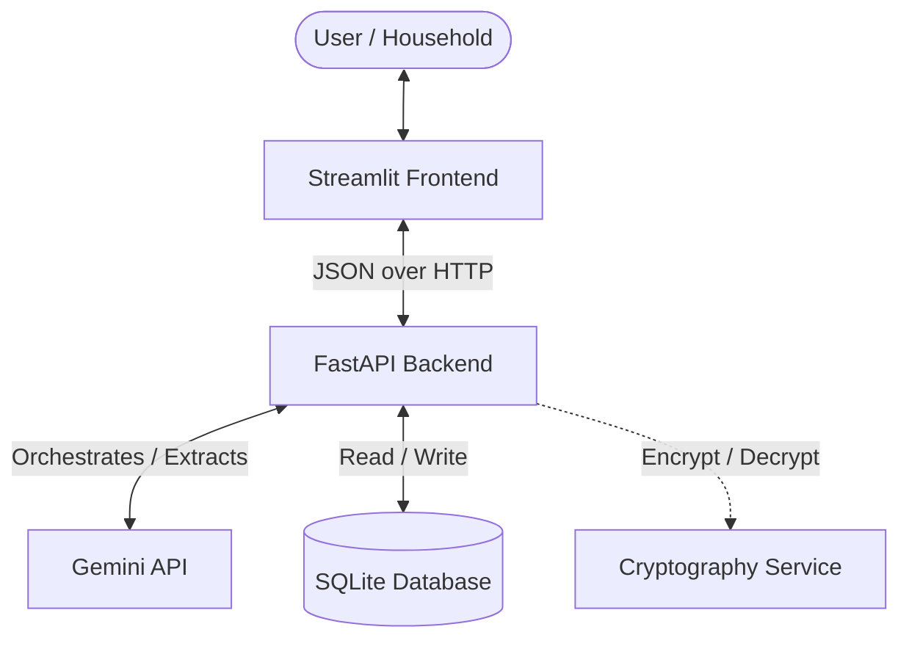
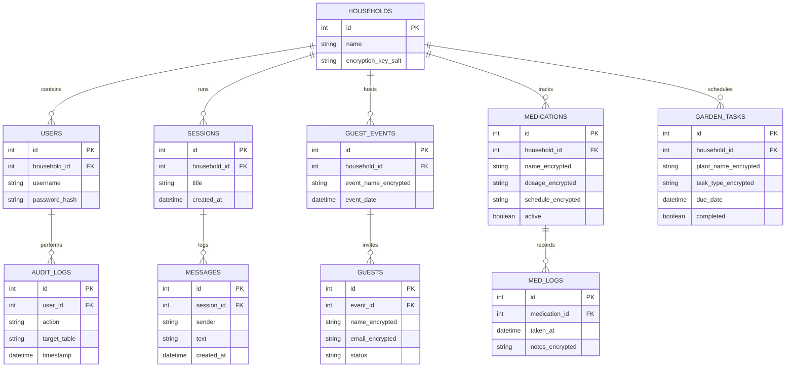

# Implementation Plan - Personal Concierge Agent

We are building a **Personal Concierge Agent**—an AI-powered assistant for individuals and households. It supports conversational task execution, decomposes natural language into structured data, keeps persistent memory, manages alerts, and uses field-level encryption for sensitive user data by default.

---

## System Architecture

The application will be divided into two main layers:
1. **Frontend (Streamlit)**: Captures user natural language input, displays the chat stream, and visualizes structured data (guest lists, medication history, garden schedules) in real-time. It communicates with the backend via REST APIs.
2. **Backend (FastAPI + LLM Orchestration + Database)**:
   - **FastAPI Layer**: Exposes secure API endpoints for authentication, chat session management, CRUD on tasks, privacy settings, and data audits.
   - **LLM Orchestration**: Parses natural language requests using a Gemini model, extracts structured actions/parameters, maps them to pluggable "Agent Skills", and updates the household's persistent context.
   - **Field-Level Encryption**: Encrypts sensitive database columns (e.g., medication names, dosage, guest emails) at rest using AES-256-GCM (via Python's `cryptography` library) with keys derived per-household.
   - **Database**: SQLite (SQLAlchemy ORM) for local MVP execution, easily migratable to PostgreSQL for production scaling.



---

## File Structure

The project will reside in `/Users/Gavrie/.gemini/antigravity/scratch/personal_concierge_agent` with the following layout:

```text
personal_concierge_agent/
├── README.md
├── requirements.txt
├── run.sh                       # Script to start backend & frontend
├── backend/
│   ├── app/
│   │   ├── __init__.py
│   │   ├── main.py              # FastAPI entry point
│   │   ├── config.py            # Env vars, keys, Gemini configurations
│   │   ├── database.py          # SQLAlchemy setup & session helper
│   │   ├── security.py          # Household JWT authentication & Fernet field-level encryption
│   │   ├── models/
│   │   │   ├── __init__.py
│   │   │   ├── base.py
│   │   │   ├── user.py          # User & Household tables
│   │   │   ├── session.py       # Chat Session & Memory tables
│   │   │   ├── guest_list.py    # Event/Guest skill tables
│   │   │   ├── medication.py    # Medication skill tables
│   │   │   └── audit.py         # Audit log table
│   │   ├── schemas/
│   │   │   ├── __init__.py
│   │   │   ├── auth.py
│   │   │   ├── chat.py
│   │   │   ├── skills.py
│   │   │   └── privacy.py
│   │   ├── services/
│   │   │   ├── __init__.py
│   │   │   ├── llm_orchestrator.py # LLM parser and intent classifier
│   │   │   ├── memory_service.py   # Context storage and retrieval
│   │   │   └── encryption_service.py # AES encryption of fields
│   │   ├── skills/
│   │   │   ├── __init__.py
│   │   │   ├── base_skill.py    # Base interface for concierge skills
│   │   │   ├── guest_planner.py # Guest / Event management skill
│   │   │   ├── med_tracker.py   # Medication schedule tracking skill
│   │   │   └── garden_planner.py # Garden planting/watering skill
│   │   └── api/
│   │       ├── __init__.py
│   │       ├── auth.py          # User signup/login
│   │       ├── chat.py          # Chat message endpoints
│   │       ├── skills.py        # Skill-specific actions
│   │       └── privacy.py       # Export/delete data & audit logs
└── frontend/
    ├── app.py                   # Streamlit entry point
    ├── api_client.py            # HTTP client wrapping backend endpoints
    ├── components/
    │   ├── chat_ui.py           # Conversational panel
    │   ├── skills_ui.py         # Dashboard for active skills
    │   └── privacy_ui.py        # "What the agent knows" & data export page
    └── style.css                # Premium styling custom overrides
```

---

## Database Schema



- **Sensitive Fields**: Any personally identifiable or medical information (e.g., guest names/emails, medication names/dosages, garden plant details) will be stored in database fields marked as `_encrypted`.
- **Zero-Knowledge Design (Simulated)**: A household master key is generated during household creation. In production, this key is derived from the user's password using Argon2/PBKDF2 and never stored in plain text, meaning server administrators cannot decrypt the personal details.

---

## API Endpoints

### 1. Authentication
* `POST /api/auth/register` - Create household and main user.
* `POST /api/auth/token` - Authenticate and obtain JWT.

### 2. Concierge Chat & LLM
* `POST /api/chat/sessions` - Start a new session.
* `GET /api/chat/sessions` - List past sessions.
* `GET /api/chat/sessions/{id}/history` - Retrieve message history.
* `POST /api/chat/sessions/{id}/message` - Post message, trigger LLM intent classification/execution, and get response.

### 3. Structured Skill API (CRUD)
* `GET /api/skills/guests` & `POST /api/skills/guests` - Manage guests and events.
* `GET /api/skills/medications` & `POST /api/skills/medications` - Track medication dosages and schedules.
* `POST /api/skills/medications/{id}/take` - Log a medication dose taken.
* `GET /api/skills/garden` & `POST /api/skills/garden` - Retrieve and update garden tasks.

### 4. Privacy & Auditing (GDPR/HIPAA Compliance)
* `GET /api/privacy/transparency` - View exactly what structured data the system holds about the household (decrypted dynamically for the authenticated user).
* `GET /api/privacy/audit-logs` - Retrieve security access audits for sensitive data reads.
* `GET /api/privacy/export` - Export all household data in a structured, plain-JSON format.
* `DELETE /api/privacy/purge` - Purge the household database entries permanently.

---

## UI Architecture (Streamlit)

The UI will leverage Streamlit's layout structures (Sidebar, Tabs, Dialogs) styled with custom CSS to provide a dark-themed glassmorphic design.

- **Sidebar**: Authentication (signup/login status), session history list, and dashboard mode selectors.
- **Tab 1: Concierge Chat**: A clean, scrolling chat interface powered by `st.chat_message`. When the user types an command (e.g. *"I need to take 500mg of Tylenol every 8 hours"*), the backend updates both the chat log and the structured data tabs dynamically.
- **Tab 2: My Logistics Dashboard**: Multi-column cards showing active logistics:
  - **Medications Panel**: Current meds, when they are due, and a button to record a taken dose.
  - **Guest List Panel**: Active events, invite status count (Attending/Pending/Declined), and a fast-add form.
  - **Garden Planner Panel**: Upcoming tasks (e.g., *"Water the tomatoes"* due today).
- **Tab 3: Privacy & Transparency**: Shows "What does the agent know about me?", raw decrypted JSON explorer, system access audit logs, and data management options (Export Data, Delete Account).

---

## Privacy, Safety, and Scale Tradeoffs

### MVP Speed vs. Production Tradeoffs
1. **Key Management**: In this MVP, household encryption keys are derived from a static secret + household salt and cached in memory. In a production system, keys should be derived on the client-side or envelope-encrypted using an external KMS (e.g., AWS KMS or Google Cloud KMS) combined with user-password-derived keys so the host server has zero visibility.
2. **Database Engine**: We use SQLite with local locks. Production scale (millions of users) requires a distributed relational database like Cloud Spanner or PostgreSQL with row-level security (RLS) policies based on `household_id`.
3. **Audit Log Security**: Audit logs are written to a standard database table. In production, audits must be streamed to an immutable, write-once-read-many (WORM) storage or Cloud Logging service to prevent internal administrators or attackers from tampering with logs.
4. **LLM Safety and PII Filter**: In production, an anonymization layer should strip direct PII (emails, exact names) before passing messages to external LLMs, replacing them with tokens, and denormalizing them only in the secure backend service. For the MVP, we pass the conversational prompts directly to Gemini but restrict LLM responses from repeating raw PII unnecessarily.

---

## Verification Plan

### Automated Tests
We will write tests in the `tests/` directory:
- Test field-level encryption (encrypt/decrypt roundtrip).
- Test FastAPI chat pipeline and intent classification mock.
- Test endpoint access control (unauthorized household cannot access another household's data).

### Manual Verification
- We will start the FastAPI backend on port 8000.
- We will run the Streamlit app on port 8501.
- We will perform end-to-end user flows (create household, chat with assistant, view data dashboard, log meds/guests, and execute privacy exports).
